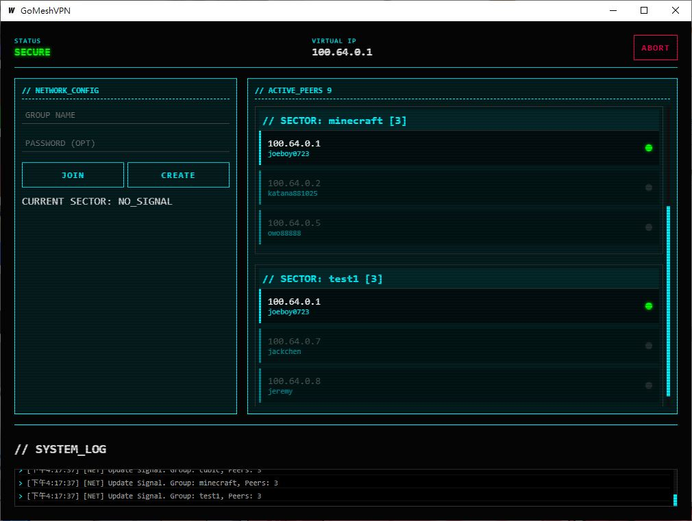
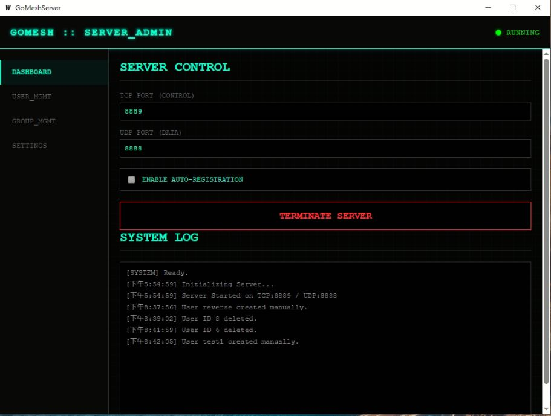

# GoMeshVPN

GoMeshVPN 是一款基於 **Wails v2** 與 **Go** 語言開發的輕量級、高效能虛擬專用網路 (VPN) 系統。本專案採用 P2P/Mesh 架構設計，包含負責帳號與群組管理的中央伺服器（GoMeshServer）以及跨平台的連線客戶端（GoMeshVPN）。

---

## 系統介面展示 (Screenshots)

### 客戶端介面 (GoMeshVPN Client)


### 伺服器端管理介面 (GoMeshServer)


---

## 專案架構說明 (Architecture)

本專案由兩個核心部分組成：

1. **GoMeshServer (伺服器端)**
   - 負責管理 VPN 使用者與通訊群組（Sector）。
   - 提供內建的 SQLite 資料庫來持久化帳號資訊。
   - 負責派發虛擬 IP 位址，並作為客戶端初始連線的協調中介（Handshake）。
   - 提供直觀的 GUI 監控面板，可即時查看日誌、在線使用者與群組狀態。

2. **GoMeshVPN (客戶端)**
   - 跨平台客戶端（支援 Windows 與 Linux）。
   - 在 Windows 上使用高效能的 **Wintun** 驅動建立虛擬網路卡。
   - 負責安全加密的封包傳輸，提供流暢的 GUI 連線管理與群組加入功能。

---

## 快速開始與編譯說明 (Getting Started)

### 預置要求 (Prerequisites)
- **Go**: 1.21 或以上版本
- **Node.js & npm**: 用於前端 GUI 建置
- **Wails CLI**: 用於打包 Go 與前端程式
  ```bash
  go install github.com/wailsapp/wails/v2/cmd/wails@latest
  ```

---

### 編譯與執行伺服器端 (Build & Run Server)
1. 進入伺服器端目錄：
   ```bash
   cd GoMeshServer
   ```
2. 進行編譯（依部署需求選擇）：
   - **純命令行模式 (推薦伺服器端部署 💡)**：
     不依賴 WebView2 與圖形庫 DLL，100% 解決在 Windows 服務或 Session 0 背景管理器中啟動失敗（`0xC0000142`）的問題。請加上 `headless` 標籤並加上 `-cli` 尾綴：
     ```bash
     go build -tags headless -o GoMeshServer-cli.exe .
     ```
   - **GUI 桌面與控制台雙模式**：
     保留桌面管理面板，並支援 CMD 指令互動（編譯後 GUI 模式下會自動隱藏黑色控制台視窗）：
     ```bash
     wails build -windowsconsole
     ```
     *編譯完成後的執行檔預設產生於 `GoMeshServer/build/bin/` 目錄中。*

3. 執行與控制 (以純命令行 `GoMeshServer-cli.exe` 為例)：
   - **命令列互動模式 (Console Mode)**：在 CMD 中指定監聽埠啟動，例如：
     ```cmd
     GoMeshServer-cli.exe -tcp_port 8889 -udp_port 8888 -auto_registration true
     ```
     啟動後會進入互動控制台並出現 `>` 提示符，您可直接輸入 `status`、`stop`、`start`、`shutdown`/`exit` 等指令即時操作。
   - **外部控制**：若伺服器在背景運行，可在另一個 CMD 視窗執行 `GoMeshServer-cli.exe stop` 安全停止服務。

---

### 編譯客戶端 (Build Client)
1. 進入客戶端目錄：
   ```bash
   cd GoMeshVPN
   ```
2. 使用 Wails 進行編譯：
   ```bash
   wails build
   ```
   *編譯完成後的執行檔會產生於 `GoMeshVPN/build/bin/` 目錄中。*
   *注意：Windows 客戶端運行時需要 `wintun.dll`（可放置於執行檔同級目錄下）。*

---

## 授權聲明 (License)

本專案採用 **MIT License** 授權釋出。
關於專案中所使用到的第三方軟體授權（包括 GPL-2.0 授權的 Wintun 驅動項目），請參閱 [THIRD-PARTY-LICENSES.md](THIRD-PARTY-LICENSES.md) 檔案。
